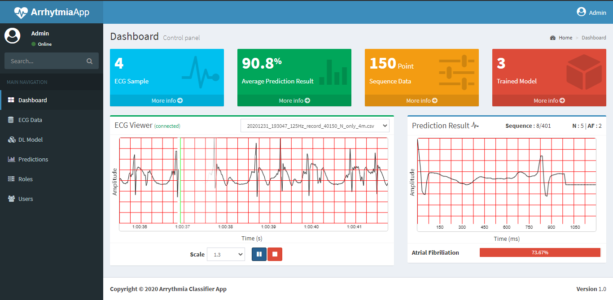

# Arrhytmia-Classifier-App
### Web based Arrhytmia Classifier 

| Web Server Gateway Intefrace (WSGI) | Werkzeug                  |
|-------------------------------------|---------------------------|
| Backend Framework                   | Flask 1.1                 |
| Telemetry                           | Websocket (Socket-IO)     |
| Templating Engine                   | Jinja 2                   |
| CSS framework                       | Bootstrap 3               |
| Template UI                         | Admin LTE                 |
| Database                            | SQL Lite                  |
| ML Backend                          | Tensorflow 2 (with Keras) |

### Realtime Inferencing using SocketIO
